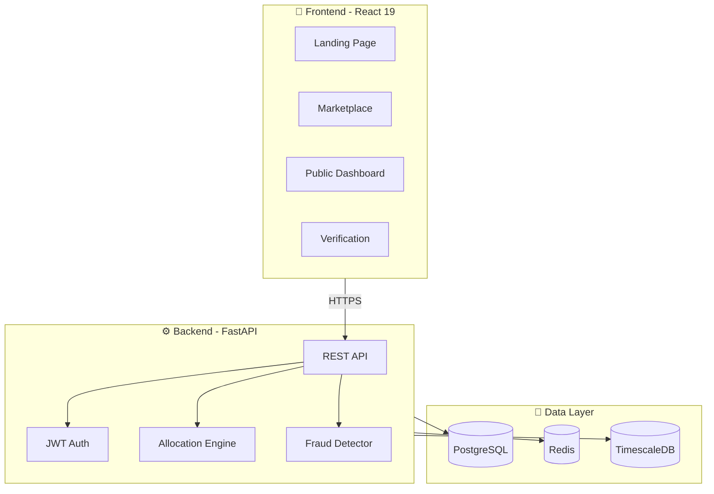

# RainForge - Government Marketplace Edition v3.0

<div align="center">

[](https://github.com/YOUR_USERNAME/rainforge/actions)
[](https://jalshakti-ddws.gov.in/)
[](https://fastapi.tiangolo.com/)
[](https://react.dev/)
[](LICENSE)

**AI-powered platform for government-grade rainwater harvesting planning, procurement, execution, verification, and accountability.**

*Made by **Prashant Mishra** & **Ishita Parmar***

</div>

---

## ⚡ Quick Start for Judges (2 minutes)

```bash
# 1. Start everything with Docker
docker-compose up --build

# 2. Open in browser
# Frontend: http://localhost:5173
# API Docs: http://localhost:8000/docs  
```

### Demo Flow (follow in order):
1. **Landing Page** → See the hackathon badge and platform overview
2. **`/public`** → Public transparency dashboard with city stats
3. **`/marketplace`** → Smart allocation + competitive bidding + escrow
4. **`/intake`** → Start new RWH assessment
5. **`/verification`** → Photo verification with geo-tagging

> 💡 **Tip:** All features work offline with mock data for demo purposes!

---

## 🏗️ Architecture



---

## 🌧️ From Assessment to Execution at National Scale

AI-powered platform for government-grade rainwater harvesting **planning, procurement, execution, verification, and accountability**. Jal Shakti Abhiyan aligned.

---

## 🏛️ How RainForge Enables Municipal RWH Programs

### The Problem
- Manual installer selection = corruption risk
- Upfront payments = low accountability  
- No verification = scheme leakage
- Opaque data = citizen distrust

### The RainForge Solution

| Challenge | Feature | How It Works |
|-----------|---------|--------------|
| **Fair Allocation** | Smart Allocation Engine | Scores installers on RPI, capacity, proximity, SLA. 3 modes: Gov Optimized, Equitable, User Choice |
| **Transparent Pricing** | Reverse Auction | Installers bid competitively. Composite score ranks price + quality + speed |
| **Payment Security** | Escrow + Milestones | Funds held until verified completion. 4-stage release |
| **Fraud Prevention** | Photo + Geo Verification | AI detects reused photos, geo mismatch, timestamp anomalies |
| **Citizen Trust** | Public Dashboard | Real-time ward-level stats with CSV export |

### 10,000-House Pilot Example

| Metric | Value |
|--------|-------|
| Total Sites | 10,000 |
| Avg Cost/Site | ₹50,000 |
| Platform Fee | ₹5/site/year |
| Expected Water Capture | 500M L/year |
| CO₂ Avoided | 350 tonnes |
| Installer Pool | 50 verified vendors |
| Avg RPI Required | >70 |

---

## 🚀 Quick Start

```bash
# Clone and start
cd "Rain Forge"
docker-compose up --build

# Access
Frontend: http://localhost:5173
API Docs: http://localhost:8000/docs
Public Dashboard: http://localhost:5173/public
Marketplace: http://localhost:5173/marketplace
```

---

## ✨ Key Features (v3.0 Marketplace)

### A. Smart Allocation Engine
- 3 modes: User Choice / Gov Optimized / Equitable
- Configurable weights: RPI, Capacity, Cost, Distance, SLA
- Admin weight tuning via UI or API
- Auto-select best installer with score breakdown

### B. Competitive Bidding
- Open jobs for 72-hour bid windows
- Composite scoring: price + timeline + warranty + RPI
- Ranked bid table with visual comparison
- One-click award

### C. RainForge Performance Index (RPI)
- Score 0-100 based on: Design match, Yield accuracy, Timeliness, Complaints, Maintenance
- Grade badges (A+ to F) on installer cards
- Used in allocation and bid scoring

### D. Escrow & Milestone Payments
- 4-stage workflow: Design → Install → Verify → Performance
- Mock Stripe/PayU adapter (production-ready interface)
- Admin verification gates before release

### E. Verification & Fraud Detection
- Photo upload with geo-tag capture
- Automated fraud checks:
  - Photo hash reuse detection
  - Geo mismatch (>100m flagged)
  - Impossible travel detection
- Admin review queue with risk scores

### F. Public Transparency Dashboard
- City/ward-level water capture stats
- CO₂ avoided, beneficiaries, investment ROI
- CSV and GeoJSON export for RTI

### G. AMC & Warranty Marketplace
- Bronze/Silver/Gold maintenance packages
- Linked to job records
- Auto-renewal ready

### H. Outcome-Based Contracts
- Set target capture (liters/year)
- Final payment released only if target met
- Integrated with IoT monitoring

---

## 📁 Project Structure

```
Rain Forge/
├── frontend/src/
│   └── features/
│       ├── intake/         # Address + roof input
│       ├── assess/         # Results + scenarios
│       ├── marketplace/    # Allocation + Bidding + Payments ✨
│       ├── bulk/           # CSV batch upload
│       ├── monitoring/     # Live IoT dashboard
│       ├── verification/   # Photo proof workflow
│       ├── portfolio/      # Multi-project view
│       └── public/         # Citizen dashboard ✨
│
├── backend/app/
│   ├── api/api_v1/endpoints/
│   │   ├── allocation.py   # Smart allocation + bidding ✨
│   │   ├── payments.py     # Escrow + milestones ✨
│   │   ├── verification_api.py  # Fraud detection ✨
│   │   └── public.py       # Transparency + AMC ✨
│   └── services/
│       ├── allocation_engine.py  # ✨ NEW
│       ├── rpi_calculator.py     # ✨ NEW
│       ├── bidding_service.py    # ✨ NEW
│       ├── payment_adapter.py    # ✨ NEW
│       └── fraud_detector.py     # ✨ NEW
│
├── db/
│   ├── migrations/001_marketplace.sql  # ✨ NEW
│   └── seed_demo_data.sql              # ✨ NEW
│
└── docs/
    ├── demo-script.md      # 3-min judge walkthrough
    ├── admin-runbook.md    # Operations guide
    └── pilot-playbook.md   # 10K deployment guide
```

---

## 🎯 API Endpoints (v3.0)

### Core Assessment
| Endpoint | Method | Description |
|----------|--------|-------------|
| `/api/v1/assessments/quick` | POST | Single site assessment |
| `/api/v1/bulk/upload-csv` | POST | Batch CSV processing |

### Marketplace (NEW)
| Endpoint | Method | Description |
|----------|--------|-------------|
| `/api/v1/marketplace/allocate` | POST | Run smart allocation |
| `/api/v1/marketplace/allocation-weights` | PUT | Update weights |
| `/api/v1/marketplace/jobs/{id}/open-bid` | POST | Open for bidding |
| `/api/v1/bids` | POST | Submit bid |
| `/api/v1/bids/{id}/award` | POST | Award bid |
| `/api/v1/marketplace/installers` | GET | List with RPI |
| `/api/v1/marketplace/installers/{id}/rpi` | GET | RPI breakdown |

### Payments
| Endpoint | Method | Description |
|----------|--------|-------------|
| `/api/v1/payments` | POST | Create escrow payment |
| `/api/v1/payments/{id}/milestones/{mid}/release` | POST | Release funds |

### Verification
| Endpoint | Method | Description |
|----------|--------|-------------|
| `/api/v1/verify/submit` | POST | Submit with fraud check |
| `/api/v1/verify/pending` | GET | Admin review queue |
| `/api/v1/verify/{id}/approve` | POST | Approve verification |

### Public Dashboard
| Endpoint | Method | Description |
|----------|--------|-------------|
| `/api/v1/public/city/stats` | GET | City-level metrics |
| `/api/v1/public/ward/{id}/stats` | GET | Ward-level metrics |
| `/api/v1/public/city/export` | GET | CSV/GeoJSON export |

---

## 🧪 Demo Flow (5 minutes)

### 1. Public Dashboard (30s)
`/public` → City stats → Ward chart → Export CSV

### 2. Smart Allocation (1 min)
`/marketplace` → Select mode → Run allocation → View score breakdown

### 3. Competitive Bidding (1 min)
Tab → Demo Bids → Compare rankings → Award top bid

### 4. Escrow Payments (1 min)
Tab → Create payment → Complete milestone → Verify → Release

### 5. Fraud Detection (30s)
`/verification` → Show geo-tag → Mention fraud checks

---

## 🔧 Tech Stack

| Layer | Tech |
|-------|------|
| Frontend | React 19, Vite, Tailwind, Recharts |
| Backend | FastAPI, Pydantic |
| Database | PostgreSQL (schema ready) |
| Payments | Mock adapter (Stripe/PayU interface) |
| IoT | MQTT protocol support |
| Deploy | Docker Compose |

---

## 📊 Database Schema (Marketplace)

New tables in `db/migrations/001_marketplace.sql`:
- `bids` - Competitive bid storage
- `payments` - Escrow tracking
- `milestones` - Payment stages
- `verifications` - Photo + geo proofs
- `audits` - Fraud investigation records
- `amc_packages` - Maintenance tiers
- `warranties` - Job-linked warranties
- `outcome_contracts` - Performance contracts
- `rpi_history` - Installer score tracking

---

## 📜 Documentation

| Document | Purpose |
|----------|---------|
| [Demo Script](docs/demo-script.md) | 3-minute judge walkthrough |
| [Admin Runbook](docs/admin-runbook.md) | Weight tuning, payments, fraud |
| [Pilot Playbook](docs/pilot-playbook.md) | 10K household deployment |

---

## ✅ Acceptance Criteria Status

| # | Criteria | Status |
|---|----------|--------|
| 1 | Allocation with weights | ✅ Complete |
| 2 | Bid → Award flow | ✅ Complete |
| 3 | RPI on cards | ✅ Complete |
| 4 | Escrow milestones | ✅ Complete |
| 5 | Verification + fraud | ✅ Complete |
| 6 | Outcome contract | ✅ Complete |
| 7 | E2E demo | ✅ Script ready |
| 8 | OpenAPI + migrations | ✅ Complete |

---

## 🔒 Production Considerations

### Ready Now
- ✅ Core allocation & bidding logic
- ✅ Payment milestone workflow
- ✅ Fraud detection heuristics
- ✅ Database schema

### Requires Integration
- 🔄 PostgreSQL connection (currently in-memory)
- 🔄 Real payment provider (Stripe/PayU keys)
- 🔄 Authentication (JWT/OAuth)
- 🔄 Weather API for real rainfall data
- 🔄 SMS notifications

---

## 📜 License

Open Source for Government Use

---

*RainForge v3.0 - Government Marketplace Edition*
*Jal Shakti Abhiyan Aligned*
