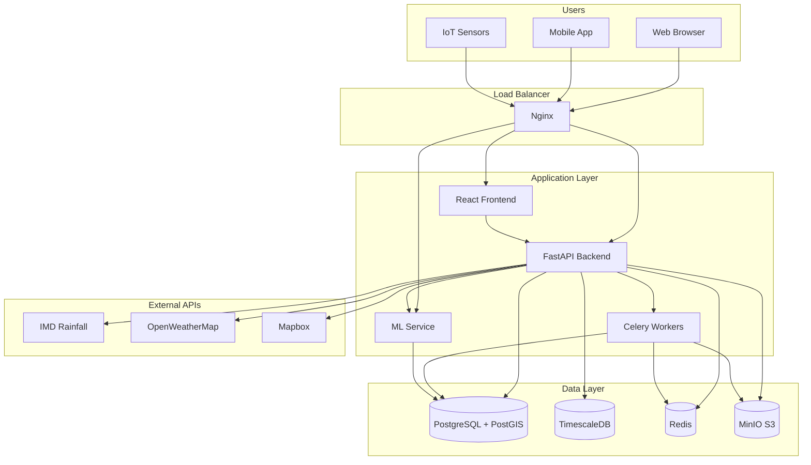
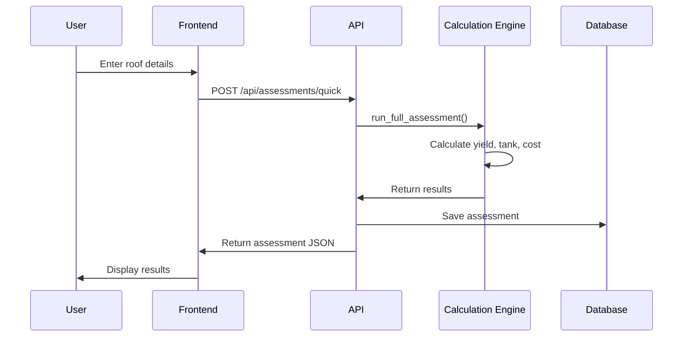
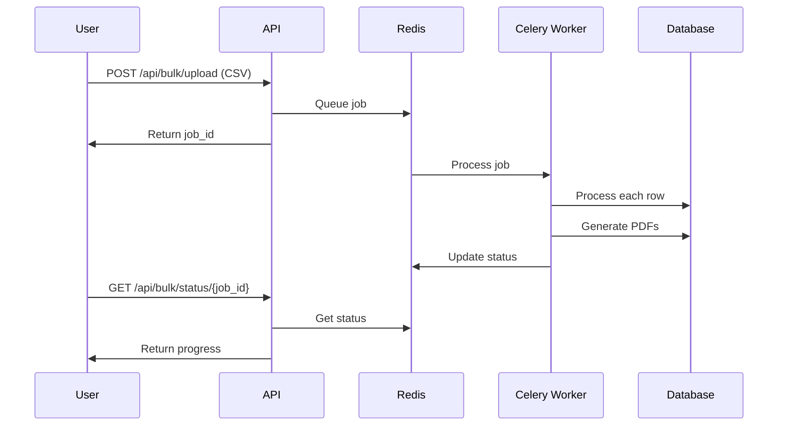
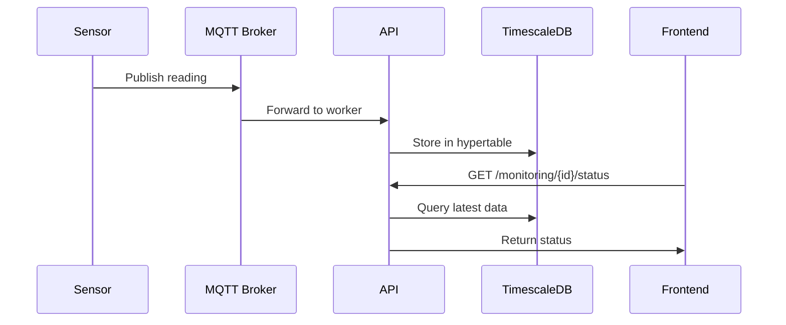
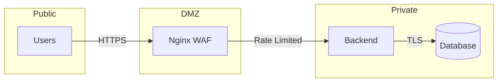

# RainForge Architecture

**Owners**: Prashant Mishra & Ishita Parmar

---

## System Overview



---

## Component Details

### Frontend (React + TypeScript)
- **Location**: `/frontend`
- **Features**:
  - Assessment wizard with map drawing
  - Monitoring dashboard with charts
  - Bulk upload with progress tracking
  - Verification photo capture

### Backend (FastAPI + Python)
- **Location**: `/backend`
- **Key Services**:
  - `calculation_engine.py` - RWH formulas
  - `assessments.py` - Quick/complete assessments
  - `bulk_api.py` - CSV processing
  - `monitoring_api.py` - Sensor ingestion

### ML Service
- **Location**: `/backend/app/ml`
- **Models**:
  - Image verification (MobileNetV2)
  - Capture prediction (weather-based)
  - Explainability endpoints

### Worker (Celery)
- **Location**: `/backend/app/worker`
- **Tasks**:
  - Bulk CSV processing
  - PDF generation
  - ML inference
  - Geocoding

---

## Data Flow

### Assessment Flow


### Bulk Processing Flow


### IoT Monitoring Flow


---

## Database Schema

### Core Tables

| Table | Purpose |
|-------|---------|
| `users` | User accounts and auth |
| `organizations` | Tenant organizations |
| `projects` | RWH project sites |
| `assessments` | Calculation results |
| `sensors` | IoT device registry |
| `monitoring_data` | Time-series readings |
| `verifications` | Photo verifications |
| `audit_log` | Immutable audit trail |

### Key Indexes

```sql
-- Spatial queries
CREATE INDEX idx_projects_geom ON projects USING GIST(roof_geom);

-- Time-series queries
SELECT create_hypertable('monitoring_data', 'timestamp');

-- Audit queries
CREATE INDEX idx_audit_project ON audit_log(entity_type, entity_id);
```

---

## Security Architecture



### Security Measures
- JWT authentication for users
- API keys for sensors
- HTTPS everywhere
- Rate limiting (10 req/sec)
- Input validation
- SQL injection prevention
- CSRF protection
- Audit logging

---

## Scalability

### Horizontal Scaling
- Stateless API containers
- Redis-backed sessions
- S3-compatible file storage
- Load balancer (Nginx)

### Performance Targets
| Metric | Target |
|--------|--------|
| Quick Assessment | < 500ms |
| Bulk (1000 rows) | < 60s |
| Sensor Ingestion | < 50ms |
| PDF Generation | < 5s |

---

## Deployment

### Docker Compose (Development)
```bash
docker-compose up --build
```

### Kubernetes (Production)
- Helm charts in `/k8s`
- Horizontal Pod Autoscaling
- PostgreSQL operator
- Ingress with TLS

---

## Monitoring

### Prometheus Metrics
- Request latency
- Error rates
- Queue depth
- Database connections

### Grafana Dashboards
- API performance
- Worker queue
- Database health
- Business metrics

---

## Tech Stack Summary

| Layer | Technology |
|-------|------------|
| Frontend | React, TypeScript, Vite |
| Backend | FastAPI, Python 3.11 |
| Database | PostgreSQL, PostGIS, TimescaleDB |
| Cache | Redis |
| Storage | MinIO (S3) |
| Queue | Celery, Redis |
| ML | TensorFlow/PyTorch |
| Proxy | Nginx |
| Containers | Docker, Kubernetes |
